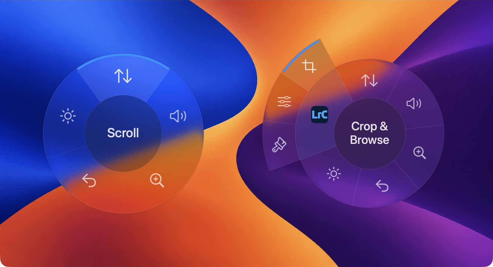
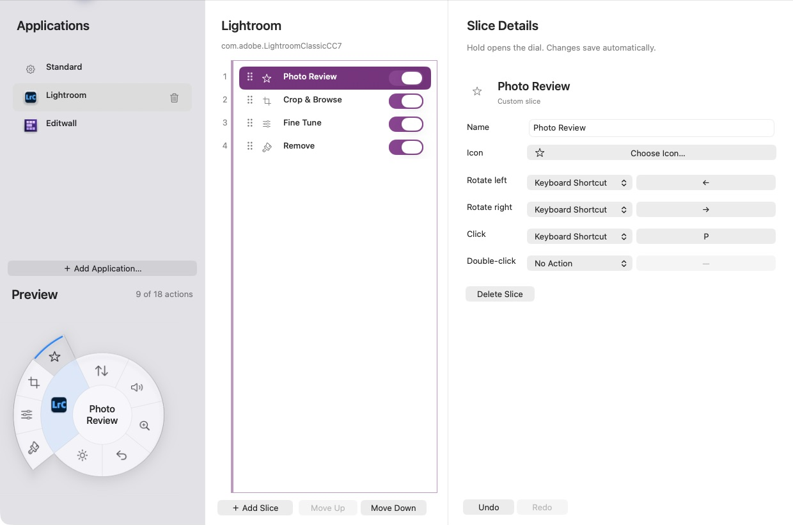

# Mac Dial — Diversified Fun fork

macOS support for Microsoft Surface Dial, with a radial mode picker, customizable
shortcuts, application-specific actions, and improved scrolling.

**Fork maintained and extended by David — Diversified Fun.** Based on
[Mac Dial by Andreas Karlsson](https://github.com/andreasjhkarlsson/mac-dial).
This is a **source-only development publication**. There is no signed or notarized
Diversified Fun download yet; upstream releases do not include this fork's changes.

[](docs/images/liquid-glass.png)

*The standard picker and Lightroom Classic controls in Liquid Glass (macOS 26+).
Hold the Dial, turn to choose, and click to select.*

## What this fork adds

- A hold-to-open radial picker with Classic and optional Liquid Glass appearance.
- Stepped, Freestyle, and Precision scrolling, with configurable sensitivity and haptics.
- Playback, Zoom, Undo/Redo, and Brightness modes.
- Contextual Lightroom Classic and Editwall actions.
- A native Customize Dial window: standard and per-application slices, shortcut
  recording, ordering, enable/disable switches, and Undo/Redo.
- Permission recovery guidance and cancellation of stale input when context changes.

[](docs/images/customize-dial.png)

*Arrange slices and assign shortcuts for each application. This Photo Review example
maps rotation to the arrow keys and click to P. Click either screenshot to view full size.*

## Requirements and compatibility

- Microsoft Surface Dial, paired through macOS Bluetooth settings.
- Apple Silicon Mac for the documented build and automated verification.
- Full Xcode 27, selected as the active developer directory (`xcode-select -p`).
- The deployment target is **macOS 12**. Publication verification runs on
  **macOS 27.0.1 with Xcode 27.0 (27A266a)**; macOS 12–26 and Intel Macs have not
  been verified for this publication. A deployment target is not a tested-support claim.
- Liquid Glass requires macOS 26 or later. Classic is available on older systems.
- macOS Accessibility/event-posting permission is required to deliver actions.

## Build from source

```sh
git clone --recurse-submodules --branch diversifiedfun https://github.com/diversifiedfun/mac-dial.git
cd mac-dial
bash build-mac-dial.sh
```

For an existing clone, initialize the pinned dependency first:

```sh
git submodule update --init --recursive
```

The script builds HIDAPI and the app with Xcode's tools; CMake and a signing account
are not required. All generated output stays in the ignored `build/` directory.
The app is `build/Build/Products/Release/MacDial.app`.

Quit any other Mac Dial copy before opening this one:

```sh
open build/Build/Products/Release/MacDial.app
```

Building does not replace an installed app. You may copy the app to Applications
manually, then launch that copy and grant it permission. Run only one copy at a time.
The build is ad-hoc signed for local development; it is not a notarized download.
Rebuilding or moving between copies can require renewing macOS privacy grants.

## First use

1. Pair the Surface Dial in Bluetooth settings.
2. Open Mac Dial and enable it in **Privacy & Security → Accessibility**
   (called **Device Control and Data Access** on the verification system).
3. Use the menu-bar icon to choose a mode. Hold the Dial to open the radial picker,
   rotate to select, and click to confirm.
4. Open **Customize Dial…** to arrange slices or add application-specific shortcuts.
   Holding is reserved for the picker; custom gestures support keyboard shortcuts.

See the [user guide](docs/USER_GUIDE.md) for gestures, scroll styles, contextual
modes, brightness behavior, and customization. Add Mac Dial to Login Items manually
if you want it to start at login.

## Frequently asked questions

### How do I make Microsoft Surface Dial work on Mac?

Pair your Microsoft Surface Dial in macOS Bluetooth settings, [build and launch
this Mac Dial fork](#build-from-source), and grant it Accessibility permission.
Then hold the Dial to open the picker, turn to choose a mode, and click to select;
see [First use](#first-use) for setup details.

### Can I download a ready-to-use Mac Dial app?

This fork currently requires [building from source](#build-from-source); there is
no signed or notarized Diversified Fun download yet. Upstream Mac Dial releases
do not include this fork's radial picker, customization, or other changes.

### Which Macs and macOS versions does Mac Dial support?

The deployment target is macOS 12, but publication verification covers Apple
Silicon on macOS 27.0.1 with Xcode 27.0; older macOS versions and Intel Macs have
not been verified. Liquid Glass requires macOS 26 or later, with Classic available
on older systems; see [Requirements and compatibility](#requirements-and-compatibility)
for the full testing limits.

### Can I customize Surface Dial buttons and shortcuts on Mac?

Yes—open **Customize Dial…** to arrange standard and per-application slices and
assign keyboard shortcuts or macOS actions to rotation left/right, click, and
double-click. Holding remains reserved for opening the picker; see the
[customization guide](docs/USER_GUIDE.md#customize-dial) for details.

### Does Surface Dial work with Lightroom Classic on Mac?

This fork includes contextual **Remove** size controls, **Fine Tune** adjustments,
and **Crop & Browse** navigation for Lightroom Classic using U.S. keyboard mappings;
cloud Lightroom is not included. Activate Remove before turning to adjust its size,
and see the [Lightroom Classic guide](docs/USER_GUIDE.md#lightroom-classic-modes) for
shortcut details and limitations. Physical Dial use and live shortcuts still need
further manual verification for this publication.

## Troubleshooting and limitations

- **Dial paused:** use **Fix Permissions…** and **Check Again**. If already enabled,
  remove the old privacy entry, quit and reopen the intended copy, and grant access again.
- **No connection:** check Bluetooth pairing and quit other Mac Dial copies.
- **Unexpected shortcut result:** actions depend on the focused app and its keyboard
  shortcuts. Built-in contextual mappings target a U.S. keyboard layout. In Lightroom,
  activate Remove before adjusting its size; otherwise those keys can change ratings.
- **Brightness:** rotation uses system brightness keys. Click-to-zero/restore uses
  optional private DisplayServices APIs and may not work for every display or preset.
  External-monitor DDC control is not implemented. A failed write retains the restore
  value; move the pointer back to the same display and click to retry.
- **Shared identity:** the original bundle identifier is retained for preference
  compatibility. This fork and upstream can share settings and privacy entries.
- Physical Dial use, live custom shortcuts, full-screen/Spaces behavior, sleep/wake,
  and older macOS versions require further manual verification for this publication.
  Automated tests do not certify those combinations.

## Privacy, contributing, and license

The reviewed production code contains no app-managed analytics, update checks, or
network requests. It stores configuration locally and reads application metadata
for contextual controls. See [Privacy](PRIVACY.md) for details and reset guidance.

See [Contributing](CONTRIBUTING.md) for tests and previews, and the
[publication audit](docs/PUBLICATION_AUDIT.md) for findings and verification limits.
Use this fork's [Issues](https://github.com/diversifiedfun/mac-dial/issues) for
reproducible bugs; remove private information from logs and screenshots.

The main project is under the [MIT license](LICENSE), preserving Andreas Karlsson's
notice. The inherited media-key helper has a **CC BY-SA 4.0** exception; HIDAPI and
other references have their own notices. See [Third-party notices](THIRD_PARTY_NOTICES.md).
